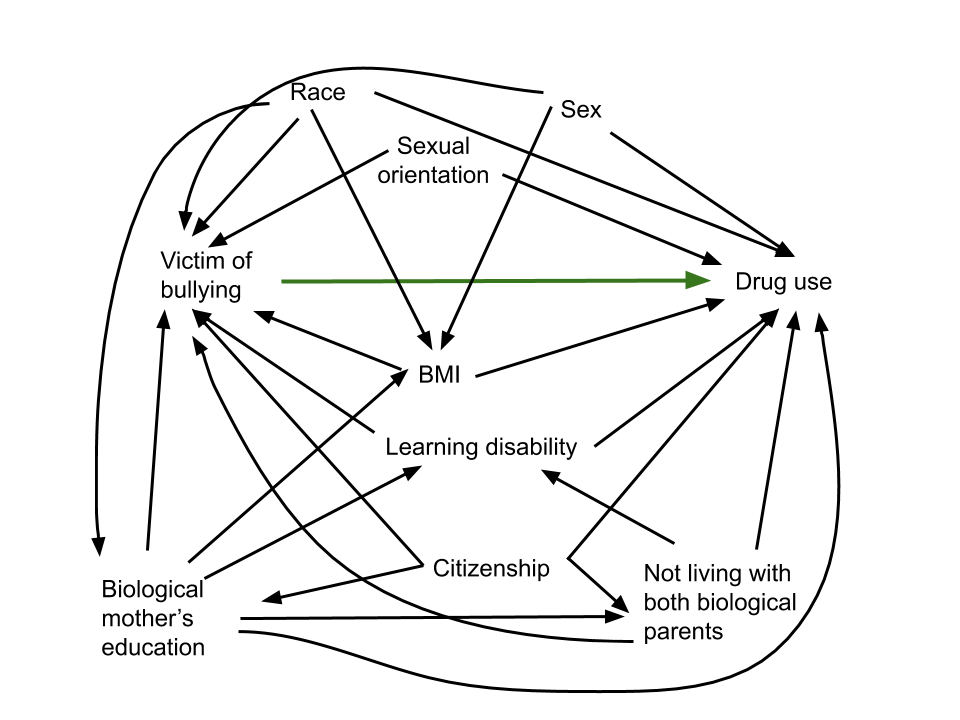
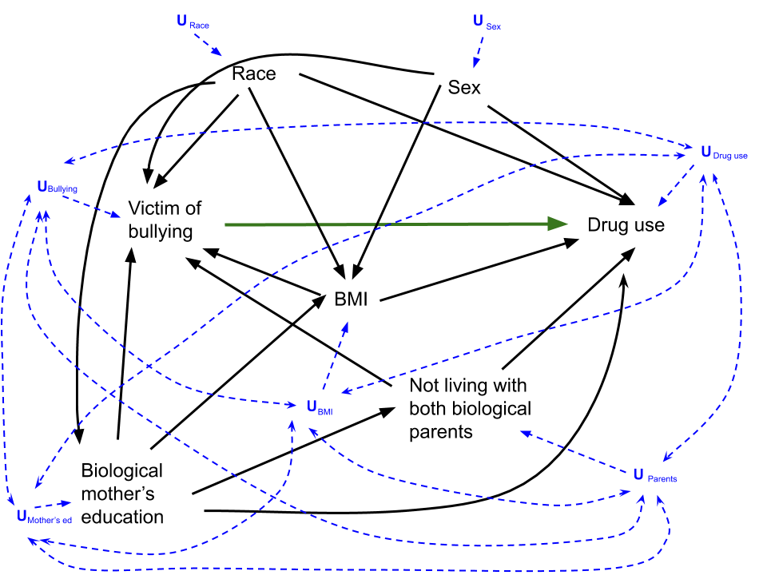
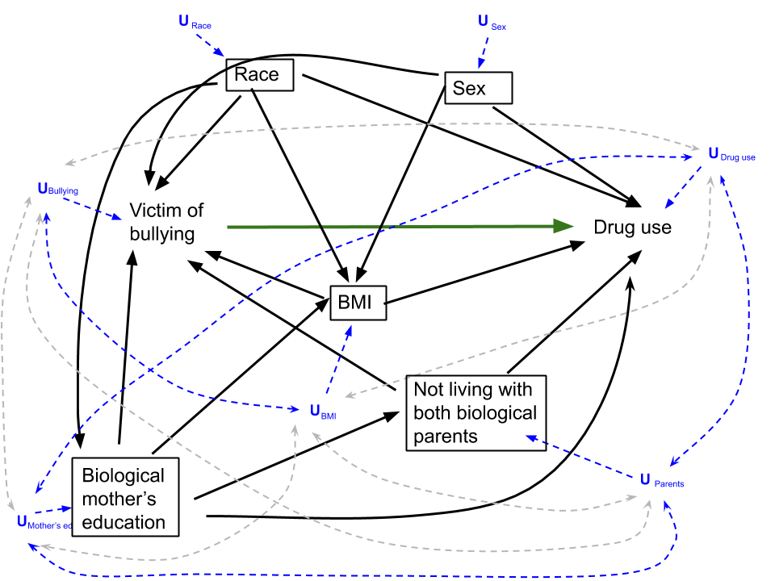

```{r setup, include=FALSE}
library(plyr)
library(dplyr)
library(ggplot2)
library(lubridate)
library(childsds)
library(epiR)
library(SuperLearner)
library(ltmle)
library(knitr)
library(tidyr)


knitr::opts_chunk$set(include = FALSE, cache = TRUE)

# First, load the data
ShelleyStephLizzyVeronicaDataLoad <- function(filename) 
{
  if(Sys.info()['sysname']=="Darwin"){
    macfilepath <- paste("./NLSY Data/", filename, sep = "")
     load(as.character(macfilepath), envir = globalenv())}
  else{
    if(Sys.info()['login']=="Peter"){
    peterfilepath <- paste("~/Steph/GitHub/finalproject/NLSY Data/", filename, sep = "")
     load(as.character(peterfilepath), envir = globalenv())}
  else{
    windowsfilepath <- paste("~/GitHub/finalproject/NLSY Data/", filename, sep = "")
     load(as.character(windowsfilepath), envir = globalenv())
  }
}
}

ShelleyStephLizzyVeronicaDataLoad("imputed_data.Rdata")
final_data <- imputed_data
rm(imputed_data)
```


```{r data cleaning}
#Let's do all Variable prep/Data cleaning in this chunk

#some cleaning of variables to rename levels for ease of visualization
final_data$bullied_bf_12_1997 <- as.factor(final_data$bullied_bf_12_1997)
final_data$bullied_bf_12_1997 <- revalue(final_data$bullied_bf_12_1997,    
                                         c("0"="NotBullied", "1"="Bullied"))

final_data$ever_new_user2 <- as.factor(final_data$ever_new_user2)
final_data$ever_new_user2 <- revalue( final_data$ever_new_user2,
                                      c("0" = "NoDrugUse", "1" = "DrugUse"))

final_data$KEY_RACE_ETHNICITY_1997 <- as.factor(final_data$KEY_RACE_ETHNICITY_1997)
final_data$KEY_RACE_ETHNICITY_1997 <- revalue(final_data$KEY_RACE_ETHNICITY_1997,    
                                         c("1"="Black", "2"="Hispanic", "3"="MixedRace", "4"="White"))

#Decision was made to remove the Mixed Race group due to small numbers
final_data <- final_data %>% filter(KEY_RACE_ETHNICITY_1997 != "MixedRace")
final_data$KEY_RACE_ETHNICITY_1997 <- droplevels(final_data$KEY_RACE_ETHNICITY_1997) #takes away the empty category

final_data$KEY_SEX_1997 <- as.factor(final_data$KEY_SEX_1997)
final_data$KEY_SEX_1997 <- revalue(final_data$KEY_SEX_1997,    
                                         c("1"="M", "2"="F"))

final_data$anySameSex <- as.factor(final_data$anySameSex)
final_data$anySameSex <- revalue(final_data$anySameSex, c("FALSE" = "NoSameSex", "TRUE" = "SomeSameSex"))

final_data$learning_disability_1997 <- as.factor(final_data$learning_disability_1997)
final_data$learning_disability_1997  <- revalue(final_data$learning_disability_1997 , c("0" = "NoLearningDisability", "1" = "LearningDisability"))

final_data$CV_CITIZENSHIP_1997 <- as.factor(final_data$CV_CITIZENSHIP_1997)
final_data$CV_CITIZENSHIP_1997 <- revalue(final_data$CV_CITIZENSHIP_1997, c("1"="BornInUS", "2"="NotBornInUS", "3"="BirthplaceUnknown"))

final_data$anySameSex <- as.factor(final_data$anySameSex)
final_data$anySameSex <- revalue(final_data$anySameSex, c("1"="SameSex", "0"="NoSameSex"))

final_data$YOUTH_BOTHBIO.01_1997 <- as.factor(final_data$YOUTH_BOTHBIO.01_1997)
final_data$YOUTH_BOTHBIO.01_1997 <- revalue(final_data$YOUTH_BOTHBIO.01_1997, c("1"="LivesWBothBioParents", "0"="DoesntLiveWBioParents"))

final_data$overweight <- as.factor(final_data$overweight)
final_data$overweight <- revalue(final_data$overweight, c("0"="NotOverweight", "1"="Overweight"))


#Categorizing the Maternal Education variable
final_data$MomEducation <- NA
final_data$MomEducation[final_data$CV_HGC_BIO_MOM_1997 < 12] <- 0
final_data$MomEducation[final_data$CV_HGC_BIO_MOM_1997 == 12] <- 1
final_data$MomEducation[final_data$CV_HGC_BIO_MOM_1997 > 12] <- 2
final_data$MomEducation <-as.factor(final_data$MomEducation)
final_data$MomEducation <- revalue(final_data$MomEducation, c("0"="LessThanHigh", "1"="HighSchlGrad", "2"="SomeCollege"))

#dichotomous version of maternal education variable
final_data$MomEduDi <- NA
final_data$MomEduDi[final_data$CV_HGC_BIO_MOM_1997 < 12] <- 1
final_data$MomEduDi[final_data$CV_HGC_BIO_MOM_1997 == 12] <- 1
final_data$MomEduDi[final_data$CV_HGC_BIO_MOM_1997 > 12] <- 2
final_data$MomEduDi <-as.factor(final_data$MomEduDi)
final_data$MomEduDi <- revalue(final_data$MomEduDi, c("1"="HighSchlOrLess", "2"="SomeCollege"))

#Using CDC growth charts (via childsds package) to get BMI Z scores by age 

 final_data <-  final_data %>%
                    mutate(bmiz = sds(BMI,
                    age = KEY_AGE_1997,
                    sex = KEY_SEX_1997, male = "M", female =  "F",
                    ref = cdc.ref,
                    item = "bmi",
                    type = "SDS"))
 
 #Note, there's one observation with a z score of -20, and some with -Inf (9 observations total)
 #final_data %>% ggplot(aes(y=bmiz)) +geom_boxplot() #can uncomment this line to see the boxplot if desired
 #We decided to exclude those 9 subjects, so
 final_data <-  final_data %>% filter(bmiz> -15) 
  
  #Overweight variable based on pediatric criteria
  final_data$PediOverweight<-"NotOverweight"
  final_data$PediOverweight[final_data$bmiz > 1.036433] <-"Overweight" #because z of 1.036433 corresponds to 85th percentile, which is the definition of overweight in kids
 final_data$PediOverweight <- as.factor(final_data$PediOverweight)
 
 save(final_data, file = "final_data_BMIz.RData")
 
```

```{r name zis chunkeh}
N <- nrow(final_data)

#drug use
druguse <- table(final_data$ever_new_user2)

#bullying
bully.table <- table(final_data$ever_new_user2, final_data$bullied_bf_12_1997) 

#drug use
race.table <- table(final_data$ever_new_user2, final_data$KEY_RACE_ETHNICITY_1997)

#sex
sex.table <- table(final_data$ever_new_user2, final_data$KEY_SEX_1997)

#mother's education
mothereduc.table <- table(final_data$ever_new_user2, final_data$MomEduDi)

#bio parents
livebioparents.table <- table(final_data$ever_new_user2, final_data$YOUTH_BOTHBIO.01_1997)

#BMI
BMI.druguse <- subset(final_data, ever_new_user2=="DrugUse", select=bmiz)
BMI.nodrugs <- subset(final_data, ever_new_user2=="NoDrugUse", select=bmiz)
```


```{r positivity checking}


#just sexual orientation with exp/out. (Note that variables are releveled to put it into the format that epiR wants)
SexOrientTable <- table(relevel(final_data$bullied_bf_12_1997,2),relevel(final_data$ever_new_user2, 2),
                   final_data$anySameSex, 
                   useNA="ifany")

#calculating test of homogeneity between strata of sexual orientation
epi.2by2(SexOrientTable)
#decision made to not use this variable based on small numbers, and no association with the measures of disease (looking at a test of homogeneity between strata)

#just learning/emotional problem with exp/out
LearningTable <- table(relevel(final_data$bullied_bf_12_1997,2),relevel(final_data$ever_new_user2, 2),
      final_data$learning_disability_1997, 
      useNA="ifany")

#calculating test of homogeneity between strata of Learning/Emotional problems 
epi.2by2(LearningTable)
#decision made to not use this variable because its learning or emotional problem at the time of the study (age 12-18), so this may not be temporally before the exposure and could actually be caused by exposure

#just citizenship with exp/out
CitizenTable <-table(relevel(final_data$bullied_bf_12_1997,2),relevel(final_data$ever_new_user2, 2),
      final_data$CV_CITIZENSHIP_1997,
      useNA="ifany")

#calculating test of homogeneity between strata of Citizenship (aka birthplace)
epi.2by2(CitizenTable)
#decision made to not use this variable because so few children were born outside the US and we're not sure if birthplace is really getting at the SES/hardship construct that we were trying to get with citizenship data


#Our set of variables
table(final_data$bullied_bf_12_1997,final_data$ever_new_user2,
      final_data$KEY_RACE_ETHNICITY_1997,  final_data$KEY_SEX_1997,
      final_data$MomEduDi, 
      final_data$PediOverweight, final_data$YOUTH_BOTHBIO.01_1997,
      useNA="ifany")

#same set but no PediOverweight variable (considering it as a continuous instead)
table(final_data$bullied_bf_12_1997,final_data$ever_new_user2,
      final_data$KEY_RACE_ETHNICITY_1997,  final_data$KEY_SEX_1997,
      final_data$MomEduDi, 
      final_data$YOUTH_BOTHBIO.01_1997,
      useNA="ifany")

#Density Plots for BMI
BMIbybullyingstatus <- final_data %>% filter(bmiz> -15) %>%
                        group_by( bullied_bf_12_1997) %>% 
                        ggplot(aes(bmiz, fill = bullied_bf_12_1997)) +
                          geom_density(alpha=0.9) +
                          scale_fill_brewer(palette = 3) +
                          theme(text = element_text(size = 30)) +
                          theme(legend.title=element_blank(), legend.key.size = unit(2, 'lines'), legend.spacing.x = unit(1, 'cm')) +
                          labs(x = "BMI Z-score for Age and Sex")

#BMIbybullyingstatus
ggsave("BMIbybullyingstatus.pdf", BMIbybullyingstatus)

#Boxplots for BMI
BMIbybullyingstatusBox <- final_data %>% filter(bmiz> -15) %>%
                        group_by( bullied_bf_12_1997) %>% 
                        ggplot(aes(y=bmiz, fill = bullied_bf_12_1997)) +
                          geom_boxplot() 
#BMIbybullyingstatusBox
ggsave("BMIbybullyingstatusBox.pdf", BMIbybullyingstatusBox)

```


``` {r estimate, cache = TRUE}
#7. Estimate
load("final_data_BMIz.RData")
set.seed(4864)

## prep data

# create dataset of Ws
X = subset(final_data, select=c("KEY_RACE_ETHNICITY_1997", "KEY_SEX_1997","bmiz", "MomEduDi", "YOUTH_BOTHBIO.01_1997"))

# add A and make numeric
X$bullied=as.numeric(final_data$bullied_bf_12_1997)
X$bullied=ifelse(X$bullied==1,0,1)

# create a vector of Y
Y = as.numeric(final_data$ever_new_user2)
Y = ifelse(Y==1, 0, 1)

# write a parametric wrapper function to include in SL library
SL.loglinear = function (Y, X, newX, family, obsWeights, id) {
    fit.loglin = glm(Y ~ ., data=X, family=poisson(link = "log"))
    pred = predict(fit.loglin, newdata=newX, type='response')
    fit = list(object=fit.loglin)
    class(fit) = "SL.loglinear"
    out <- list(pred = pred, fit = fit)
    return(out)
}
predict.SL.loglinear <- function(object, newdata, ...) {
  # newdata must be a dataframe, not a matrix.
  if (is.matrix(newdata)) {
    newdata = as.data.frame(newdata)
  }
  pred <- predict(object = object$object, newdata = newdata, type = "response")
  pred
}

# Create SL library
SL.library = c("SL.glm","SL.glm.interaction","SL.glmnet", "SL.bayesglm", "SL.randomForest",  "SL.step", "SL.mean", "SL.loglinear")


##G-comp with SuperLearner##

# set treatment at 0 and 1
X0 = X
X0$bullied = 0

X1=X
X1$bullied = 1

#run SL 
SL.pred = SuperLearner(Y=Y, X=X, SL.library=SL.library, family='binomial', cvControl=list(V=5))

# get predicted outcomes under both scenarios
predict.1 = predict(SL.pred, newdata=X1)$pred
predict.0 = predict(SL.pred, newdata=X0)$pred

#g-comp for ATE
gComp = mean(predict.1-predict.0)


## Stabilized IPTW with SuperLearner ##

# make A a vector
A=X$bullied
# just Ws
W = subset(X, select=c(1:5))

# estimate treatment mechanism
gAW.sl = SuperLearner(Y=A, X=W, SL.library=SL.library, family='binomial', cvControl=list(V=5))
# predicted prob of observed treatment
pred.g1W = gAW.sl$SL.predict 
pred.g0W = 1- pred.g1W
gAW = ifelse(A==1, pred.g1W, pred.g0W)
# weights = 1/prob treatment
wt = 1/gAW
# Stabilized IPTW estimator 
AY = as.data.frame(cbind(A,Y))
IPTW = mean( wt*as.numeric(AY$A==1)*AY$Y)/mean( wt*as.numeric(AY$A==1)) -
mean( wt*as.numeric(AY$A==0)*AY$Y)/mean( wt*as.numeric(AY$A==0))


## TMLE ##

WAY = cbind(X, Y)
ltmle.SL<- ltmle(data=WAY, Anodes="bullied", Ynodes="Y", abar=list(1,0), SL.library=SL.library, attr(SL.library, "return.fit"))
tmle.summary = summary(ltmle.SL)
TMLE = tmle.summary$effect.measures$ATE
# performance of algorithms
ltmle.SL$fit
# CV risk
CVrisk = CV.SuperLearner(Y=Y, X=X, SL.library=SL.library, family='binomial', cvControl=list(V=5))
CVsummary = summary(CVrisk)
CVtable = CVsummary$Table

## unadjusted ATE ##
unadjusted = mean(WAY$Y[WAY$bullied==1]) - mean(WAY$Y[WAY$bullied==0])


```


```{r bootstrap}
#I've commented out this ENTIRE chunk, merely so it doesn't try to bootstrap every time we knit our slides/report 

#these two packages allow for paralellization of the analysis using multiple computer processor cores
#library(foreach)
#library(doParallel)
#library(doRNG) #you need a particular package in order to make paralellization reproducible...eyeroll 

# set.seed(252)
# 
# #set the number of bootstrap iterations (B)
# B <- 1000
# 
# #set the total number in our sample
# n <- nrow(WAY)
# 
# 
# numCores <- detectCores()  #detect number of processor cores on the computer
# registerDoParallel(numCores)  # use multicore, set to the number of cores on this computer
# 
# BootstrappedEsts <- foreach (b=1:B, .combine=rbind, .packages='SuperLearner') %dorng% { 
#   #this is just a paralellized  version of a for loop
#   
# #these create a new single sample which was resampled (with replacement)from our original sample
# bootIndices<- sample(1:n, replace=T)
# bootData<- WAY[bootIndices,]
# 
# #From here to almost the end of the function is just Veronica's code from above but with all the various bits renamed to bootstrapped versions
# 
# 
# # Create SL library
# SL.library = c("SL.glm","SL.glm.interaction","SL.glmnet", "SL.bayesglm", "SL.randomForest",  "SL.step", "SL.mean")
# 
# 
#   ##G-comp with SuperLearner##
# 
# # set treatment at 0 and 1
# X0.boot = bootData
# X0.boot$bullied = 0
# 
# X1.boot=bootData
# X1.boot$bullied = 1
# 
# #create a dataset with just the A and Ws
# WA.boot <- subset(bootData, select=c("KEY_RACE_ETHNICITY_1997", "KEY_SEX_1997","bmiz", "MomEduDi", "YOUTH_BOTHBIO.01_1997", "bullied"))
# 
# #run SL 
# SL.pred.boot = SuperLearner(Y=bootData$Y, X=WA.boot, SL.library=SL.library, family='binomial', cvControl=list(V=5))
# 
# # get predicted outcomes under both scenarios
# predict.1.boot = predict(SL.pred.boot, newdata=X1.boot)$pred
# predict.0.boot = predict(SL.pred.boot, newdata=X0.boot)$pred
# 
# #g-comp for ATE
# gComp.boot = mean(predict.1.boot-predict.0.boot)
# 
# 
# ## Stabilized IPTW with SuperLearner ##
# 
# # make A a vector
# A.boot=bootData$bullied
# # just Ws
# W.boot = subset(bootData, select=c(1:5))
# 
# # estimate treatment mechanism
# gAW.sl.boot = SuperLearner(Y=A.boot, X=W.boot, SL.library=SL.library, family='binomial', cvControl=list(V=5))
# # predicted prob of observed treatment
# pred.g1W.boot = gAW.sl.boot$SL.predict 
# pred.g0W.boot = 1- pred.g1W.boot
# gAW.boot = ifelse(A==1, pred.g1W.boot, pred.g0W.boot)
# # weights = 1/prob treatment
# wt.boot = 1/gAW.boot
# # Stabilized IPTW estimator 
# AY.boot = as.data.frame(cbind(A.boot,Y.boot=bootData$Y))
# IPTW.boot = mean( wt*as.numeric(AY.boot$A.boot==1)*AY.boot$Y.boot)/mean( wt*as.numeric(AY.boot$A.boot==1)) -
# mean( wt*as.numeric(AY.boot$A.boot==0)*AY.boot$Y.boot)/mean(wt*as.numeric(AY.boot$A.boot==0))
# 
# 
# ## TMLE ##
# 
# # ltmle.SL.boot<- ltmle(data=bootData, Anodes="bullied", Ynodes="Y", abar=list(1,0), SL.library=SL.library, attr(SL.library, "return.fit"))
# # tmle.summary.boot = summary(ltmle.SL.boot)
# # TMLE.boot = tmle.summary.boot$effect.measures$ATE
# 
# 
#   c(gComp.boot, IPTW.boot)
# }
# 
# BootstrappedEsts <-as.data.frame(BootstrappedEsts)
# 
# save(BootstrappedEsts, file = "BootstrappedEsts.RData")
# 
# 

```

```{r using bootstrapped data}
load("BootstrappedEsts2000.RData")
BootstrappedEsts2000 <- as.data.frame(BootstrappedEsts2000)
BootstrappedEsts2000 <- BootstrappedEsts2000  %>% rename("gCompBoot" = V1, "IPTWboot" = V2)

#make a long data version of the bootstrapped estimates to be able to plot them together on one histogram/density plot
Bootstrapped_long <- gather(BootstrappedEsts2000, Estimator, value, gCompBoot:IPTWboot)

BootstrappedHist <- Bootstrapped_long %>% group_by(Estimator) %>%
    ggplot(aes(value, fill = Estimator)) +
    geom_histogram(color = "black", binwidth = 0.001, size = 0.1) +
    scale_fill_brewer(palette = 5, labels = c("G-comp", "IPTW")) +
    scale_x_continuous(limits = c(-0.04,0.12)) +
    xlab("Average Treatment Effect Value") +
    theme(legend.title=element_blank(), legend.key.size = unit(2, 'lines'), legend.spacing.x = unit(1, 'cm')) +
    ggtitle("Histograms of G-comp and IPTW Estimands \n From 2000 Bootstrap Repetitions") +
  theme(text = element_text(size = 26))

#little for loop to create confidence interval for each of the two estimators based on our bootstrapped data
CIs <-matrix(rep(NA, 6), nrow = 2, ncol = 2)
for (c in 1:2){
   CI.quant  <- quantile(BootstrappedEsts2000[ ,c], prob=c(0.025,0.975))
   CIs[c,] <- CI.quant
}
rownames(CIs) <-c("Gcomp","IPTW")
colnames(CIs) <-c("95% CI Lower Limit", "95% CI Upper Limit")
```

```{r visualizing positivity}

PositivityData <- WAY

PositivityData$gAW <- gAW
PositivityData$Y <- as.factor(PositivityData$Y)

IPTWDensityPlot <- PositivityData %>% group_by(Y) %>%
    ggplot(aes(gAW, fill = Y)) +
    geom_density(alpha=0.4) +
    scale_fill_brewer(palette = 3, labels = c("No drug use", "Drug Use")) +
    scale_x_continuous(limits = c(0,1)) +
    xlab("Probability of AW") +
    theme(legend.title=element_blank(), legend.key.size = unit(2, 'lines'), legend.spacing.x = unit(1, 'cm')) +
    ggtitle("Density Plot of AW Probabilities By Outcome Group") +
  theme(text = element_text(size = 30))

```


# Causal Question: What is the effect of having been bullied prior to age 12 on incidence of drug use in adolescence or adulthood?


## Specify a Causal Model

Our dataset:
  
- National Longitudinal Survey of Youth 
- Nationally representative cohort of youth age 12-16
- Initial recruitment n = 9000 in 1997
- In our final dataset n = 7703

<!-- Our data are from the National Longitudinal Survey of Youth 1997. This was recruited as a nationally representative cohort of youth age 12-16 (initial n=9000) in 1997. These youth have since been followed longitudinally. The target population is youth in the United States. -->

## Original DAG
<!--This is the original DAG we developed while looking at what was available in the dataset: -->


```{r DAG Initial, echo=FALSE, include = TRUE, out.width = '100%'}

```


<!--LIZZY TO TURN THIS INTO A REAL PARAGRAPH
We decided to exclude the following covariates for these reasons:
-Sexual orientation - this wasn't associated with the exposure/outcome (strata are homogenous by sexual orientation (p=0.09), doesn't affect outcome)
-Citizenship - this is actually country of birth, which is not quite what we wanted
-Learning disability - this is actually learning or emotional problem, and the latter could be influenced by being bullied

Therefore, here is our final DAG for this analysis:-->

## Final DAG 
```{r DAG Final, echo=FALSE, include = TRUE, out.width = '100%'}
knitr::include_graphics("DAG Causal Final Project_reduced covariates.png")
```


## Structural Equations
*LIZZY TO CLEAN THIS UP*  
Endogenous nodes: X = (W, A, Y), where W = (W1, W2, W3, W4, W5) is the set of baseline covariates, A is victim of bullying, and Y is drug use.

Background variables (Exogenous nodes): U = (UW, UA, UY) ~ PU. We place no assumptions on the distribution PU. We have not placed any restrictions on the functional forms.

Structural equations F:

W1 = fW1 (UW1, W3)
W2  = fW2  (UW2)
W3  = fW3  (UW3)
W4  = fW4 (UW4, W1)
W5  = fW5 (UW5, W1, W2, W3)
A = fA (UA, W1, W2, W3, W4, W5)
Y = fY (UY, A, W1, W2, W3, W4, W5)

W1 = Mother's education; W2  = Sex; W3  = Race/ethnicity;  W4  = Living with both biological parents; W5  = BMI

## Target Causal Parameter

  - Difference in the counterfactual probability of drug use if all kids were bullied prior to age 12, and the counterfactual probability of drug use if all kids were not bullied prior to age 12:

$$
\psi^F (P_{U,X}) = P_{U,X} (Y_1 = 1) - P_{{U,X}}(Y_0=1) = E_{U,X}(Y_1) - E_{U,X}(Y_0)
$$
where $Y_a$ denotes the counterfactual outcome under an intervention to set bullying status A = a.


## Our Observed Data

A: Bullying before the age of 12 (asked in 1997)

Y: Incident drug use ("cocaine or other hard drugs") after 1997

Ws: Race/ethnicity, age, sex, BMI, not living with both biological parents, mother's educational status (all Ws were measured at baseline)

Sample size: 7,703

The target population is youth in the United States.


## Link to the SCM

We assume that the observed data O = (W, A, Y) ~ $\mathbb{P}_0$ were generated by sampling n times from a data generating process described by the SCM. The statistical model $\mathcal{M}$ for the set of allowed distributions for the observed data is non-parametric. 

## Table 1

\fontsize{8}{8} \selectfont 

Covariate | Drug use (\%) |  No drug use (\%) |
--------- | ---------- | --------- |
$\textbf{Drug use (Total)}$ | `r druguse[2]` (`r round(druguse[2]/N,1)`\%) | `r druguse[1]` (`r round(druguse[1]/N,1)`\%) |
|||
$\textbf{Victim of bullying}$ | | |
Yes | `r bully.table[2,2]` (`r round(race.table[2,2]/N*100, 1)`\%) | `r race.table[1,2]` (`r round(race.table[1,2]/N*100, 1)`\%)
No | `r bully.table[2,1]` (`r round(race.table[2,1]/N*100, 1)`\%) | `r race.table[1,1]` (`r round(race.table[1,1]/N*100, 1)`\%)
|||
$\textbf{Mother's education}$ | | |
High school or less | `r mothereduc.table[1,1]` (`r round(mothereduc.table[1,1]/N*100, 1)`\%) | `r mothereduc.table[2,1]` (`r round(mothereduc.table[2,1]/N*100, 1)`\%)
Some college or more | `r mothereduc.table[2,2]` (`r round(mothereduc.table[2,2]/N*100, 1)`\%) | `r mothereduc.table[1,2]` (`r round(mothereduc.table[1,2]/N*100, 1)`\%)
|||
$\textbf{Sex}$ | | |
Female | `r sex.table[2,2]` (`r round(sex.table[2,2]/N*100, 1)`\%) | `r sex.table[1,2]` (`r round(sex.table[1,2]/N*100, 1)`\%)
Male | `r sex.table[2,1]` (`r round(sex.table[2,1]/N*100, 1)`\%) | `r sex.table[1,1]` (`r round(sex.table[1,1]/N*100, 1)`\%)
|||
$\textbf{Race/ethnicity}$ | | | 
Black | `r race.table[2,1]` (`r round(race.table[2,1]/N*100, 1)`\%) | `r race.table[1,1]` (`r round(race.table[1,1]/N*100, 1)`\%)
Hispanic | `r race.table[2,2]` (`r round(race.table[2,2]/N*100, 1)`\%) | `r race.table[1,2]` (`r round(race.table[1,2]/N*100, 1)`\%)
White | `r race.table[2,3]` (`r round(race.table[2,3]/N*100, 1)`\%) | `r race.table[1,3]` (`r round(race.table[1,3]/N*100, 1)`\%)
|||
$\textbf{Living with both biological parents}$ | | |
Yes | `r livebioparents.table[2,2]` (`r round(livebioparents.table[2,2]/N*100, 1)`\%) | `r livebioparents.table[1,2]` (`r round(livebioparents.table[1,2]/N*100, 1)`\%)
No | `r livebioparents.table[2,1]` (`r round(livebioparents.table[2,1]/N*100, 1)`\%) | `r livebioparents.table[1,1]` (`r round(livebioparents.table[1,1]/N*100, 1)`\%)
|||
$\textbf{BMI percentile}$ | `r round(mean(BMI.druguse$bmiz),3)` (*mean*) |  `r round(mean(BMI.nodrugs$bmiz),3)` (*mean*) |
\textcolor{white}{x} | `r round(sd(BMI.druguse$bmiz),2)` (*sd*) |  `r round(sd(BMI.nodrugs$bmiz),2)` (*sd*) |


<!--
## Marginal distribution of exposure and outcome:

```{r, include=FALSE}
#marginal distribution of exposure
exposure = table(final_data$bullied_bf_12_1997, useNA="ifany")

#marginal distribution of outcome
outcome = table(final_data$ever_new_user2, useNA = "ifany")
```
Variable | No | Yes 
-------- | ------- | -------
Bullied < 12 | `r exposure[1]` | `r exposure[2]`
Incident drug use | `r outcome[1]` | `r outcome[2]`
-->


## Identifiability

<!--If there were no independence assumptions, this would be our DAG:-->
```{r DAG 3, echo=FALSE, include = TRUE, out.width = '100%'}
knitr::include_graphics("DAG Causal Final Project_reduced covariates with Us.png")
```


## Identifiability

<!--In reality, we believe there are no shared unknowns between Race or Sex with any other variables; therefore, this is what we think is most true for our DAG:-->
```{r DAG 4, echo=FALSE, include = TRUE, out.width = '100%'}

```

## Identifiability

<!--However, under this initial causal model the target parameter cannot be identified, because there are a large number of backdoor pathways. To block the backdoor pathways and create an identified target parameter, we would need to control for all of the endogenous covariates in our model, and would need to also add a series of independence assumptions for convenience (with the previously assumed shared unknowns shown below in grey). We think the shared unknowns represented by the grey dotted lines are less plausible than in the remaining cases of shared unknowns (remaining in blue), and allow us to make progress on the causal roadmap.-->

```{r DAG 5, echo=FALSE, include = TRUE, out.width = '100%'}

```


## Identifiability

<!--We could improve the plausibility of these additional independence assumptions by identifying potentially shared unknowns and gathering data on them so they can be controlled for in the model. For example, income; social status; and access to fresh, healthy food are all examples of potential shared confounders of biological mother's education and BMI. If we measured those variables and controlled for them in our model, it would be more plausible to assume independence between the unknowns contributing to both of those nodes. 

Once these independence assumptions have been agreed to for convenience, we have d-separation and can proceed with our analysis using an identifiable target parameter, using the final DAG below.-->
```{r DAG 6, echo=FALSE, include = TRUE, out.width = '100%'}
knitr::include_graphics("DAG Causal Final Project_reduced covariates with Us_final.png")
```


## Estimand and Statistical Model
The target parameter of the observed data distribution (which equals the causal parameter in the augmented causal model $\mathcal{M}^{F\star}$) is the G-Computation formula:
```{r estimand, echo=FALSE, include = TRUE}

```

This is our statistical estimand.


## Estimation: Unadjusted ATE & SuperLearner

- The unadjusted ATE = mean(Y|A=1 - Y|A=0) = `r round(unadjusted, 3)`

- We use SuperLearner for prediction in all models. 
  - Library: `r SL.library`
  - 5-fold cross-validation

## Checking for Practical Positivity Violations

- We tabulated exposure and outcome across all possible levels of our categorical variables

- Observations exist in every possible category of our variable set

- Our for our only continuous variable, BMI z-score (for age and sex), we looked at the distribution of BMI z scores in the two exposure categories

```{r, include = TRUE, echo = FALSE, fig.width=14, fig.height = 6}

BMIbybullyingstatus

```

## Positivity: Assessing the Model Weights

```{r, include = TRUE, echo = FALSE, fig.width= 16, fig.height = 10}

IPTWDensityPlot

```

## Confidence Intervals

- For TMLE, used the robust method built in to the ltmle package

- For G-comp and IPTW we performed a bootstrap

```{r, include = TRUE, echo = FALSE, warning = FALSE, fig.width= 16, fig.height = 10}
BootstrappedHist
```

## Estimation: G-comp, IPTW, & TMLE

Estimator | ATE (95% CI)
--------------- | ---------------
G-computation | `r round(gComp, 3)` (`r round(CIs[1,1],3)`, `r round(CIs[1,2],3)`)
Stabilized IPTW | `r round(IPTW, 3)` (`r round(CIs[2,1],3)`, `r round(CIs[2,2],3)`)
TMLE | `r round(TMLE$estimate, 3)` (`r round(TMLE$CI[1,1], 3)`, `r round(TMLE$CI[1,2], 3)`)


## Estimation: SuperLearner convex combinations

Algorithm | A Risk | A Coefficient | Y Risk | Y Coefficient
--------- | ---------- | --------- | ---------- | ---------
glm | `r ltmle.SL$fit$g[[2]]$bullied[1,1]` | `r ltmle.SL$fit$g[[2]]$bullied[1,2]` | `r ltmle.SL$fit$Q[[2]]$Y[1.1]` | `r ltmle.SL$fit$Q[[2]]$Y[1,2]`
glm.interaction | `r ltmle.SL$fit$g[[2]]$bullied[2,1]` | `r ltmle.SL$fit$g[[2]]$bullied[2,2]` | `r ltmle.SL$fit$Q[[2]]$Y[2,1]` | `r ltmle.SL$fit$Q[[2]]$Y[2,2]`
glmnet | `r ltmle.SL$fit$g[[2]]$bullied[3,1]` | `r ltmle.SL$fit$g[[2]]$bullied[3,2]` | `r ltmle.SL$fit$Q[[2]]$Y[3,1]` | `r ltmle.SL$fit$Q[[2]]$Y[3,2]`
bayesglm | `r ltmle.SL$fit$g[[2]]$bullied[4,1]` | `r ltmle.SL$fit$g[[2]]$bullied[4,2]` | `r ltmle.SL$fit$Q[[2]]$Y[4,1]` | `r ltmle.SL$fit$Q[[2]]$Y[4,2]`
randomForest | `r ltmle.SL$fit$g[[2]]$bullied[5,1]` | `r ltmle.SL$fit$g[[2]]$bullied[5,2]` | `r ltmle.SL$fit$Q[[2]]$Y[5,1]` | `r ltmle.SL$fit$Q[[2]]$Y[5,2]`
step | `r ltmle.SL$fit$g[[2]]$bullied[6,1]` | `r ltmle.SL$fit$g[[2]]$bullied[6,2]` | `r ltmle.SL$fit$Q[[2]]$Y[6,1]` | `r ltmle.SL$fit$Q[[2]]$Y[6,2]`
mean | `r ltmle.SL$fit$g[[2]]$bullied[7,1]` | `r ltmle.SL$fit$g[[2]]$bullied[7,2]` | `r ltmle.SL$fit$Q[[2]]$Y[7,1]` | `r ltmle.SL$fit$Q[[2]]$Y[7,2]`
loglinear | `r ltmle.SL$fit$g[[2]]$bullied[8,1]` | `r ltmle.SL$fit$g[[2]]$bullied[8,2]` | `r ltmle.SL$fit$Q[[2]]$Y[8,1]` | `r ltmle.SL$fit$Q[[2]]$Y[8,2]`


## Estimation: SuperLearner performance
CV.SuperLearner

Algorithm | Avg Risk | SE 
--------- | ---------- | --------- 
SuperLearner | `r CVtable$Ave[1]` | `r CVtable$se[1]`
Discrete SL | `r CVtable$Ave[2]` | `r CVtable$se[2]`
glm | `r CVtable$Ave[3]` | `r CVtable$se[3]`
glm.interaction | `r CVtable$Ave[4]` | `r CVtable$se[4]`
glmnet | `r CVtable$Ave[5]` | `r CVtable$se[5]`
bayesglm | `r CVtable$Ave[6]` | `r CVtable$se[6]`
randomForest | `r CVtable$Ave[7]` | `r CVtable$se[7]`
step | `r CVtable$Ave[8]` | `r CVtable$se[8]`
mean | `r CVtable$Ave[9]` | `r CVtable$se[9]`
loglinear | `r CVtable$Ave[10]` | `r CVtable$se[10]`


## Results
<!--According to our analysis, the difference between the average counterfactual risk of drug use if everyone was bullied versus if no one was bullied is 0.04, causally interpreted to mean that if people are bullied they are about 4% more likely to use drugs later in life than if they are not bullied. This is a plausible finding, though we expected it to be even higher; it makes sense that we would see this in our data, however, because drug use is typically underreported due to social desirability bias, biasing our risk difference toward the null. 

Our G-computation estimator had the lowest ATE estimate but greatest precision of our three estimators at 0.039 (95% CI: 0.017 - 0.034). Our stabilized IPTW estimator had the highest ATE estimate and moderate precision, at 0.045 (95% CI: 0.018 - 0.084). Our TMLE estimator produced an estimate of 0.044 (95% CI 0.007 - 0.08), with lowest precision. Ultimately, these estimators appear to have performed similarly, with much overlap between the point estimate and confidence intervals of each estimator's ATE.

Our analysis includes a number of limitations. First, there were a number of covariates that were exogenous, which we would have measured and included had we been prospectively collecting data instead of using an existing dataset. As one important example of this, we did not have any information on parent drug use, which we would have wanted to control for as an important confounder in our model (for identifiability we also needed to assume no shared unknowns between bullying and drug use, where this would obviously have also fit). It is likely incorporated into our model as one of the shared unknowns of not living with both biological parents, and our outcome (drug use). Second, while the data were collected, we did not include any mental health variables as endogenous variables in our model, because the questions were extremely vague, and the temporality was unclear (i.e., we couldn't determine that mental health wasn't caused by exposure). Mental health is likely an important covariate to include in this analysis, potentially as a confounder or a mediator of the exposure and outcome. And third, the independence assumptions that we created out of necessity identify the target causal parameter were likely not correct, introducing confounder-based biased into our results.

The results of this analysis allow policymakers and school administrators to better identify youth who are at risk for starting to use drugs as a result of bullying, and provide them with additional services and social supports. It also supports the use of anti-bullying interventions in schools, as prevention of incident substance use later in life will also lead to a reduction in many of the adverse health outcomes associated with use of drugs.-->

According to our analysis:  

- the difference between the average counterfactual risk of drug use if everyone was bullied versus if no one was bullied is 0.04  
  
- __causal interpretation__: if people are bullied they are about 4% more likely to use drugs later in life than if they are not bullied  

## Results

Estimator | ATE (95% CI)
--------------- | ---------------
G-computation | `r round(gComp, 3)` (`r round(CIs[1,1],3)`, `r round(CIs[1,2],3)`)
Stabilized IPTW | `r round(IPTW, 3)` (`r round(CIs[2,1],3)`, `r round(CIs[2,2],3)`)
TMLE | `r round(TMLE$estimate, 3)` (`r round(TMLE$CI[1,1], 3)`, `r round(TMLE$CI[1,2], 3)`)

## Limitations

1. Important exogenous variables  
+ Parent drug use  
+ Mental health  
  
2. Necessary independence assumptions

## Impacts

- Identify youth who are at risk for starting to use drugs as a result of bullying  

- Supports use of anti-bullying interventions in schools.


## Contributions of the Team Members

- Suggestion of a dataset and potential issues for exploration: Veronica

- Particular expertise that we each contributed:
\begin{enumerate}
     \item Shelley - Project management
     \item Stephanie - Pediatrics 
     \item Veronica - Social and Substance Use Epi
     \item Lizzy - Social and Substance Use Epi
   \end{enumerate}
   
- Establishment of the causal model, delineation of the causal question and estimand of choice: Entire group

- Identifiability considerations: Entire group, with Lizzy and Shelley working on the DAG

- Creation of slides for causal question, SCM, background on our dataset: Lizzy and Shelley

- Coding of SuperLearner estimation: Veronica

- Coding of Practical Positivity Checks and Bootstrapping of Confidence Intervals: Stephanie

- Interpretation of Results: Entire Group

<!-- Causal Question Material:
The relationship between bullying and drug use has previously been explored. This association has been examined both among youth who are perpetrators of bullying and youth who are victims of bullying. A 2016 meta-analysis found that youth who bully are at least twice as likely compared with non-involved students to use drugs later in life (OR = 2.22, 95% CI: 1.60-3.07). However, when adjusting for confounding variables, the adjusted summary effect size was markedly reduced to an OR of 1.41 (95% CI: 1.20-1.66), suggesting that much of the variation is explained by other contributing factors.$^1$


According to a 2012 paper, youth involved in bullying were more likely than students not involved in bullying to use substances, with bullying victims reporting the greatest levels of substance use.$^2$ Longitudinal analyses have shown that youth who experience mental or physical bullying, separately or in combination, were more likely to subsequently report use of substances (alcohol, cigarettes, marijuana, and inhalants). This finding held after controlling for baseline covariates (gender, grade level, ethnicity and substance).$^3$ 

Drug use in adolescence or adulthood has been associated with adverse health outcomes, such as substance use disorder, overdose, infectious disease acquisition, and other major medical illnesses. Preventing bullying victimization may have downstream effects by preventing substance use initiation.$^4$ 

To our knowledge, no studies have evaluated the relationship between bullying victimization and drug use using causal inference approaches. This study fills a gap in the literature by studying this question in a causal framework. -->

<!-- 
## References

$1.$ Ttofi MM, Farrington DP, Losel F, Crago RV, Theodorakis N. (2016) School bullying and drug use later in life: A meta-analytic investigation. School Psychology Quarterly. 31(1): 8-27.
$2.$ Radliff KM, Wheaton JE, Robinson K, Morris J. (2012) Illuminating the relationship between bullying and substance use among middle and high school youth. Addictive Behaviors. 37(4): 569-572.
$3.$ Tharp-Taylor S, Haviland A, D'Amico EJ. (2009) Victimization from mental and physical bullying and substance use in early adolescence. Addictive Behaviors. 34(6-7): 561-567.
$4.$ Sarlin E. (2017) Substance Use Disorders Are Associated With Major Medical Illnesses and Mortality Risk in a Large Integrated Health Care System. Bethesda, MD: National Institute on Drug Abuse, October 24.
-->

