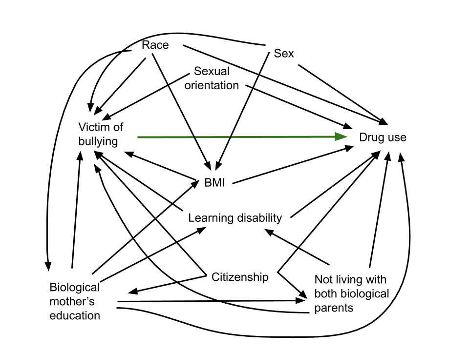
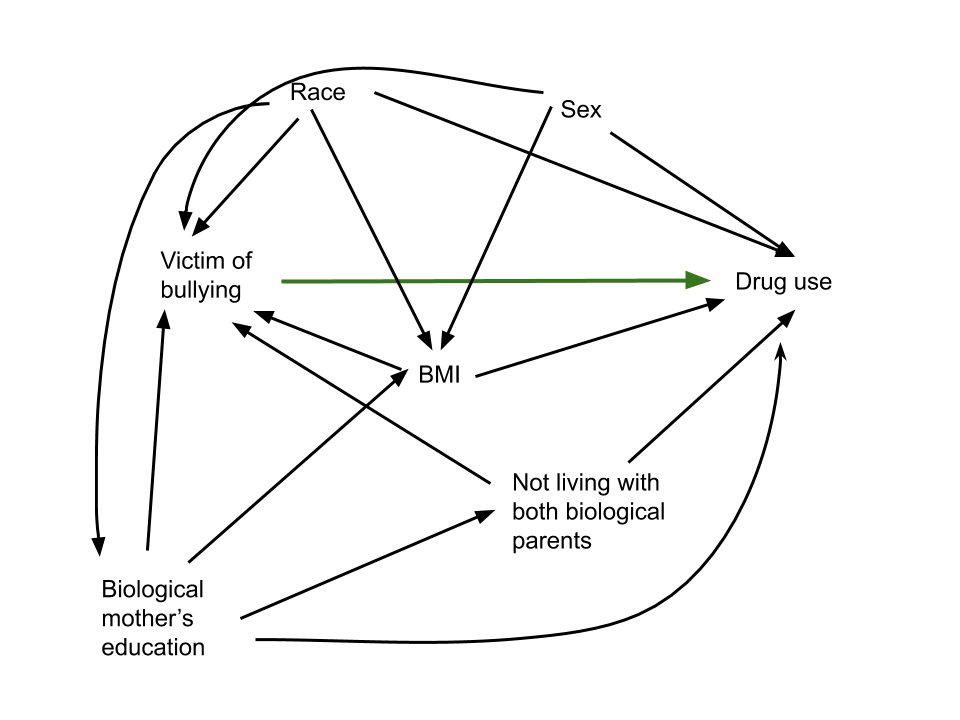
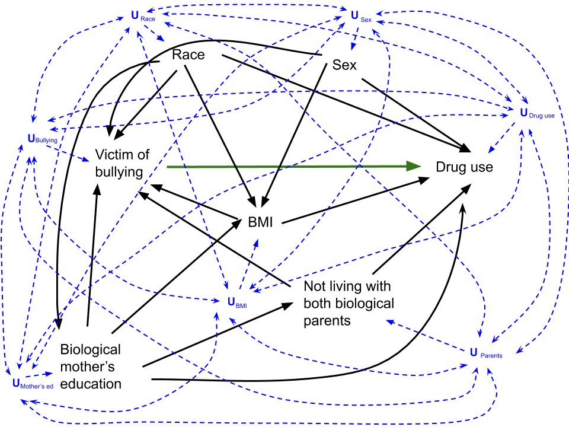
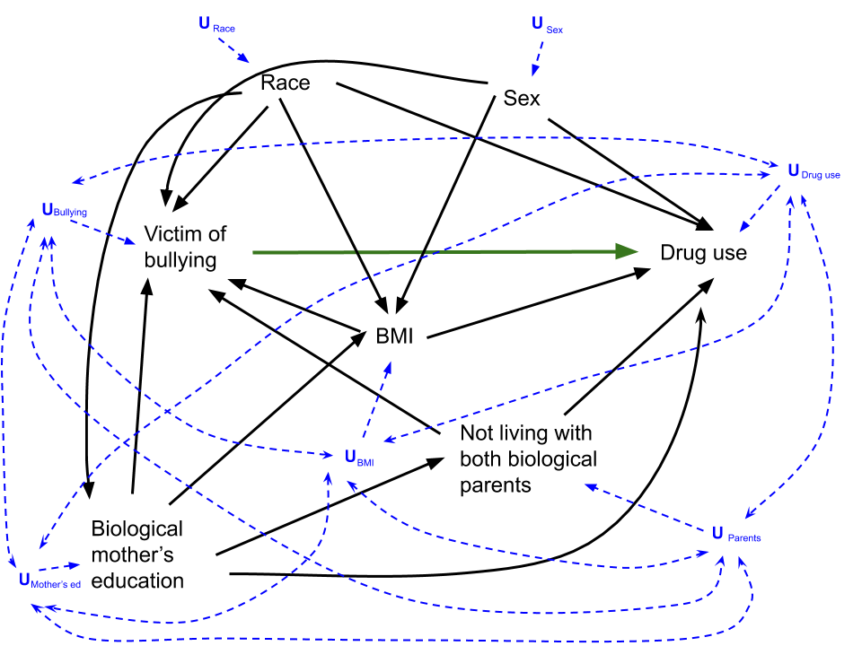
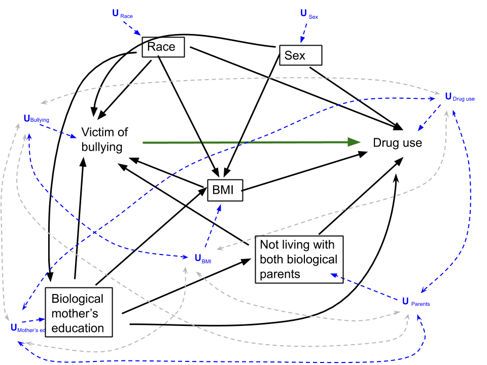
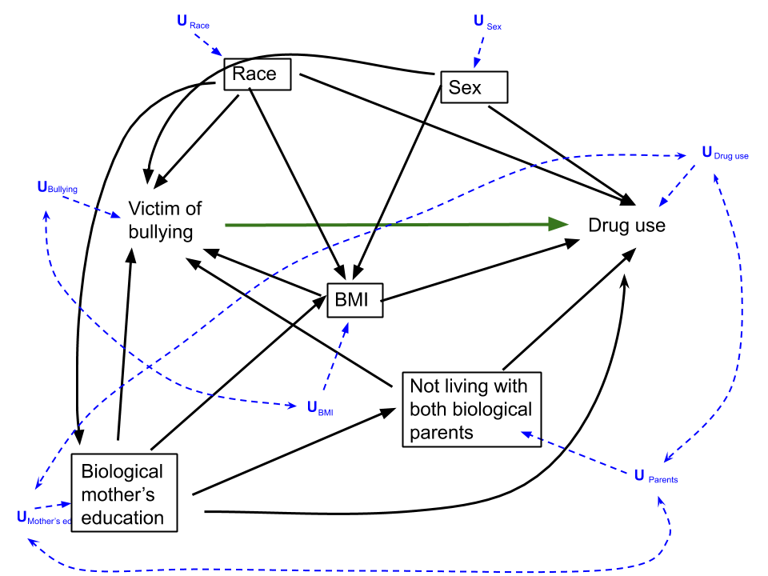

```{r setup, include=FALSE}
library(plyr)
library(dplyr)
library(ggplot2)
library(lubridate)
library(childsds)
library(epiR)
library(SuperLearner)
library(ltmle)
library(knitr)
library(tidyr)


knitr::opts_chunk$set(include = FALSE, cache = TRUE)

# First, load the data
ShelleyStephLizzyVeronicaDataLoad <- function(filename) 
{
  if(Sys.info()['sysname']=="Darwin"){
    macfilepath <- paste("./NLSY Data/", filename, sep = "")
     load(as.character(macfilepath), envir = globalenv())}
  else{
    if(Sys.info()['login']=="Peter"){
    peterfilepath <- paste("~/Steph/GitHub/finalproject/NLSY Data/", filename, sep = "")
     load(as.character(peterfilepath), envir = globalenv())}
  else{
    windowsfilepath <- paste("~/GitHub/finalproject/NLSY Data/", filename, sep = "")
     load(as.character(windowsfilepath), envir = globalenv())
  }
}
}

ShelleyStephLizzyVeronicaDataLoad("imputed_data.Rdata")
final_data <- imputed_data
rm(imputed_data)
```


```{r data cleaning}
#Let's do all Variable prep/Data cleaning in this chunk

#some cleaning of variables to rename levels for ease of visualization
final_data$bullied_bf_12_1997 <- as.factor(final_data$bullied_bf_12_1997)
final_data$bullied_bf_12_1997 <- revalue(final_data$bullied_bf_12_1997,    
                                         c("0"="NotBullied", "1"="Bullied"))

final_data$ever_new_user2 <- as.factor(final_data$ever_new_user2)
final_data$ever_new_user2 <- revalue( final_data$ever_new_user2,
                                      c("0" = "NoDrugUse", "1" = "DrugUse"))

final_data$KEY_RACE_ETHNICITY_1997 <- as.factor(final_data$KEY_RACE_ETHNICITY_1997)
final_data$KEY_RACE_ETHNICITY_1997 <- revalue(final_data$KEY_RACE_ETHNICITY_1997,    
                                         c("1"="Black", "2"="Hispanic", "3"="MixedRace", "4"="White"))

#Decision was made to remove the Mixed Race group due to small numbers
final_data <- final_data %>% filter(KEY_RACE_ETHNICITY_1997 != "MixedRace")
final_data$KEY_RACE_ETHNICITY_1997 <- droplevels(final_data$KEY_RACE_ETHNICITY_1997) #takes away the empty category

final_data$KEY_SEX_1997 <- as.factor(final_data$KEY_SEX_1997)
final_data$KEY_SEX_1997 <- revalue(final_data$KEY_SEX_1997,    
                                         c("1"="M", "2"="F"))

final_data$anySameSex <- as.factor(final_data$anySameSex)
final_data$anySameSex <- revalue(final_data$anySameSex, c("FALSE" = "NoSameSex", "TRUE" = "SomeSameSex"))

final_data$learning_disability_1997 <- as.factor(final_data$learning_disability_1997)
final_data$learning_disability_1997  <- revalue(final_data$learning_disability_1997 , c("0" = "NoLearningDisability", "1" = "LearningDisability"))

final_data$CV_CITIZENSHIP_1997 <- as.factor(final_data$CV_CITIZENSHIP_1997)
final_data$CV_CITIZENSHIP_1997 <- revalue(final_data$CV_CITIZENSHIP_1997, c("1"="BornInUS", "2"="NotBornInUS", "3"="BirthplaceUnknown"))

final_data$anySameSex <- as.factor(final_data$anySameSex)
final_data$anySameSex <- revalue(final_data$anySameSex, c("1"="SameSex", "0"="NoSameSex"))

final_data$YOUTH_BOTHBIO.01_1997 <- as.factor(final_data$YOUTH_BOTHBIO.01_1997)
final_data$YOUTH_BOTHBIO.01_1997 <- revalue(final_data$YOUTH_BOTHBIO.01_1997, c("1"="LivesWBothBioParents", "0"="DoesntLiveWBioParents"))

final_data$overweight <- as.factor(final_data$overweight)
final_data$overweight <- revalue(final_data$overweight, c("0"="NotOverweight", "1"="Overweight"))


#Categorizing the Maternal Education variable
final_data$MomEducation <- NA
final_data$MomEducation[final_data$CV_HGC_BIO_MOM_1997 < 12] <- 0
final_data$MomEducation[final_data$CV_HGC_BIO_MOM_1997 == 12] <- 1
final_data$MomEducation[final_data$CV_HGC_BIO_MOM_1997 > 12] <- 2
final_data$MomEducation <-as.factor(final_data$MomEducation)
final_data$MomEducation <- revalue(final_data$MomEducation, c("0"="LessThanHigh", "1"="HighSchlGrad", "2"="SomeCollege"))

#dichotomous version of maternal education variable
final_data$MomEduDi <- NA
final_data$MomEduDi[final_data$CV_HGC_BIO_MOM_1997 < 12] <- 1
final_data$MomEduDi[final_data$CV_HGC_BIO_MOM_1997 == 12] <- 1
final_data$MomEduDi[final_data$CV_HGC_BIO_MOM_1997 > 12] <- 2
final_data$MomEduDi <-as.factor(final_data$MomEduDi)
final_data$MomEduDi <- revalue(final_data$MomEduDi, c("1"="HighSchlOrLess", "2"="SomeCollege"))

#Using CDC growth charts (via childsds package) to get BMI Z scores by age 

 final_data <-  final_data %>%
                    mutate(bmiz = sds(BMI,
                    age = KEY_AGE_1997,
                    sex = KEY_SEX_1997, male = "M", female =  "F",
                    ref = cdc.ref,
                    item = "bmi",
                    type = "SDS"))
 
 #Note, there's one observation with a z score of -20, and some with -Inf (9 observations total)
 #final_data %>% ggplot(aes(y=bmiz)) +geom_boxplot() #can uncomment this line to see the boxplot if desired
 #We decided to exclude those 9 subjects, so
 final_data <-  final_data %>% filter(bmiz> -15) 
  
  #Overweight variable based on pediatric criteria
  final_data$PediOverweight<-"NotOverweight"
  final_data$PediOverweight[final_data$bmiz > 1.036433] <-"Overweight" #because z of 1.036433 corresponds to 85th percentile, which is the definition of overweight in kids
 final_data$PediOverweight <- as.factor(final_data$PediOverweight)
 
 save(final_data, file = "final_data_BMIz.RData")
 
```

```{r creation of Table 1}
N <- nrow(final_data)

#drug use
druguse <- table(final_data$ever_new_user2)

#bullying
bully.table <- table(final_data$ever_new_user2, final_data$bullied_bf_12_1997) 

#drug use
race.table <- table(final_data$ever_new_user2, final_data$KEY_RACE_ETHNICITY_1997)

#sex
sex.table <- table(final_data$ever_new_user2, final_data$KEY_SEX_1997)

#mother's education
mothereduc.table <- table(final_data$ever_new_user2, final_data$MomEduDi)

#bio parents
livebioparents.table <- table(final_data$ever_new_user2, final_data$YOUTH_BOTHBIO.01_1997)

#BMI
BMI.druguse <- subset(final_data, ever_new_user2=="DrugUse", select=bmiz)
BMI.nodrugs <- subset(final_data, ever_new_user2=="NoDrugUse", select=bmiz)
```

```{r positivity checking}


#just sexual orientation with exp/out. (Note that variables are releveled to put it into the format that epiR wants)
SexOrientTable <- table(relevel(final_data$bullied_bf_12_1997,2),relevel(final_data$ever_new_user2, 2),
                   final_data$anySameSex, 
                   useNA="ifany")

#calculating test of homogeneity between strata of sexual orientation
epi.2by2(SexOrientTable)
#decision made to not use this variable based on small numbers (n=269), and no association with the measures of disease (looking at a test of homogeneity between strata)

#just learning/emotional problem with exp/out
LearningTable <- table(relevel(final_data$bullied_bf_12_1997,2),relevel(final_data$ever_new_user2, 2),
      final_data$learning_disability_1997, 
      useNA="ifany")

#calculating test of homogeneity between strata of Learning/Emotional problems 
epi.2by2(LearningTable)
#decision made to not use this variable because its learning or emotional problem at the time of the study (age 12-18), so this may not be temporally before the exposure and could actually be caused by exposure

#just citizenship with exp/out
CitizenTable <-table(relevel(final_data$bullied_bf_12_1997,2),relevel(final_data$ever_new_user2, 2),
      final_data$CV_CITIZENSHIP_1997,
      useNA="ifany")

#decision made to not use this variable because so few children were born outside the US and we're not sure if birthplace is really getting at the SES/hardship construct that we were trying to get with citizenship data


#Our set of variables
table(final_data$bullied_bf_12_1997,final_data$ever_new_user2,
      final_data$KEY_RACE_ETHNICITY_1997,  final_data$KEY_SEX_1997,
      final_data$MomEduDi, 
      final_data$PediOverweight, final_data$YOUTH_BOTHBIO.01_1997,
      useNA="ifany")

#same set but no PediOverweight variable (considering it as a continuous instead)
table(final_data$bullied_bf_12_1997,final_data$ever_new_user2,
      final_data$KEY_RACE_ETHNICITY_1997,  final_data$KEY_SEX_1997,
      final_data$MomEduDi, 
      final_data$YOUTH_BOTHBIO.01_1997,
      useNA="ifany")

#Density Plots for BMI
BMIbybullyingstatus <- final_data %>% filter(bmiz> -15) %>%
                        group_by( bullied_bf_12_1997) %>% 
                        ggplot(aes(bmiz, fill = bullied_bf_12_1997)) +
                          geom_density(alpha=0.9) +
                          scale_fill_brewer(palette = 3) +
                          theme(text = element_text(size = 22)) +
                          theme(legend.title=element_blank(), legend.key.size = unit(2, 'lines'), legend.spacing.x = unit(1, 'cm')) +
                          labs(x = "BMI Z-score for Age and Sex")

#BMIbybullyingstatus
ggsave("BMIbybullyingstatus.pdf", BMIbybullyingstatus)

#Boxplots for BMI
BMIbybullyingstatusBox <- final_data %>% filter(bmiz> -15) %>%
                        group_by( bullied_bf_12_1997) %>% 
                        ggplot(aes(y=bmiz, fill = bullied_bf_12_1997)) +
                          geom_boxplot() 
#BMIbybullyingstatusBox
ggsave("BMIbybullyingstatusBox.pdf", BMIbybullyingstatusBox)

```

``` {r estimate, cache = TRUE}
#7. Estimate
load("final_data_BMIz.RData")
set.seed(4864)

## prep data

# create dataset of Ws
X = subset(final_data, select=c("KEY_RACE_ETHNICITY_1997", "KEY_SEX_1997","bmiz", "MomEduDi", "YOUTH_BOTHBIO.01_1997"))

# add A and make numeric
X$bullied=as.numeric(final_data$bullied_bf_12_1997)
X$bullied=ifelse(X$bullied==1,0,1)

# create a vector of Y
Y = as.numeric(final_data$ever_new_user2)
Y = ifelse(Y==1, 0, 1)

# write a parametric wrapper function to include in SL library
SL.loglinear = function (Y, X, newX, family, obsWeights, id) {
    fit.loglin = glm(Y ~ ., data=X, family=poisson(link = "log"))
    pred = predict(fit.loglin, newdata=newX, type='response')
    fit = list(object=fit.loglin)
    class(fit) = "SL.loglinear"
    out <- list(pred = pred, fit = fit)
    return(out)
}
predict.SL.loglinear <- function(object, newdata, ...) {
  # newdata must be a dataframe, not a matrix.
  if (is.matrix(newdata)) {
    newdata = as.data.frame(newdata)
  }
  pred <- predict(object = object$object, newdata = newdata, type = "response")
  pred
}

# Create SL library
SL.library = c("SL.glm","SL.glm.interaction","SL.glmnet", "SL.bayesglm", "SL.randomForest",  "SL.step", "SL.mean")


##G-comp with SuperLearner##

# set treatment at 0 and 1
X0 = X
X0$bullied = 0

X1=X
X1$bullied = 1

#run SL 
SL.pred = SuperLearner(Y=Y, X=X, SL.library=SL.library, family='binomial', cvControl=list(V=5))

# get predicted outcomes under both scenarios
predict.1 = predict(SL.pred, newdata=X1)$pred
predict.0 = predict(SL.pred, newdata=X0)$pred

#g-comp for ATE
gComp = mean(predict.1-predict.0)


## Stabilized IPTW with SuperLearner ##

# make A a vector
A=X$bullied
# just Ws
W = subset(X, select=c(1:5))

# estimate treatment mechanism
gAW.sl = SuperLearner(Y=A, X=W, SL.library=SL.library, family='binomial', cvControl=list(V=5))
# predicted prob of observed treatment
pred.g1W = gAW.sl$SL.predict 
pred.g0W = 1- pred.g1W
gAW = ifelse(A==1, pred.g1W, pred.g0W)
# weights = 1/prob treatment
wt = 1/gAW
# Stabilized IPTW estimator 
AY = as.data.frame(cbind(A,Y))
IPTW = mean( wt*as.numeric(AY$A==1)*AY$Y)/mean( wt*as.numeric(AY$A==1)) -
mean( wt*as.numeric(AY$A==0)*AY$Y)/mean( wt*as.numeric(AY$A==0))


## TMLE ##

WAY = cbind(X, Y)
ltmle.SL<- ltmle(data=WAY, Anodes="bullied", Ynodes="Y", abar=list(1,0), SL.library=SL.library, attr(SL.library, "return.fit"))
tmle.summary = summary(ltmle.SL)
TMLE = tmle.summary$effect.measures$ATE
# performance of algorithms
ltmle.SL$fit
# CV risk
CVrisk = CV.SuperLearner(Y=Y, X=X, SL.library=SL.library, family='binomial', cvControl=list(V=5))
CVsummary = summary(CVrisk)
CVtable = CVsummary$Table

## unadjusted ATE ##
unadjusted = mean(WAY$Y[WAY$bullied==1]) - mean(WAY$Y[WAY$bullied==0])


```

```{r bootstrap}
# #I've commented out this ENTIRE chunk, merely so it doesn't try to bootstrap every time we knit our slides/report 
# 
# #these two packages allow for paralellization of the analysis using multiple computer processor cores
# library(foreach)
# library(doParallel)
# library(doRNG) #you need a particular package in order to make paralellization reproducible...eyeroll 
# 
# set.seed(252)
# 
# 
# #set the number of bootstrap iterations (B)
# B <- 4
# 
# 
# #set the total number in our sample
# n <- nrow(WAY)
# 
# 
# numCores <- detectCores()  #detect number of processor cores on the computer
# registerDoParallel(numCores)  # use multicore, set to the number of cores on this computer
# 
# BootstrappedEsts <- foreach (b=1:B, .combine=rbind, .packages='SuperLearner') %dorng% {
#   #this is just a paralellized  version of a for loop
# 
# #these create a new single sample which was resampled (with replacement)from our original sample
# bootIndices<- sample(1:n, replace=T)
# bootData<- WAY[bootIndices,]
# 
# #From here to almost the end of the function is just Veronica's code from above but with all the various bits renamed to bootstrapped versions
# 
# 
# # Create SL library
# SL.library = c("SL.glm","SL.glm.interaction","SL.glmnet", "SL.bayesglm", "SL.randomForest",  "SL.step", "SL.mean")
# 
# 
#   ##G-comp with SuperLearner##
# 
# # set treatment at 0 and 1
# X0.boot = bootData
# X0.boot$bullied = 0
# 
# X1.boot=bootData
# X1.boot$bullied = 1
# 
# #create a dataset with just the A and Ws
# WA.boot <- subset(bootData, select=c("KEY_RACE_ETHNICITY_1997", "KEY_SEX_1997","bmiz", "MomEduDi", "YOUTH_BOTHBIO.01_1997", "bullied"))
# 
# #run SL
# SL.pred.boot = SuperLearner(Y=bootData$Y, X=WA.boot, SL.library=SL.library, family='binomial', cvControl=list(V=5))
# 
# # get predicted outcomes under both scenarios
# predict.1.boot = predict(SL.pred.boot, newdata=X1.boot)$pred
# predict.0.boot = predict(SL.pred.boot, newdata=X0.boot)$pred
# 
# #g-comp for ATE
# gComp.boot = mean(predict.1.boot-predict.0.boot)
# 
# 
# 
# ## Stabilized IPTW with SuperLearner ##
# 
# # make A a vector
# A.boot=bootData$bullied
# # just Ws
# W.boot = subset(bootData, select=c(1:5))
# 
# # estimate treatment mechanism
# gAW.sl.boot = SuperLearner(Y=A.boot, X=W.boot, SL.library=SL.library, family='binomial', cvControl=list(V=5))
# # predicted prob of observed treatment
# pred.g1W.boot = gAW.sl.boot$SL.predict
# pred.g0W.boot = 1- pred.g1W.boot
# gAW.boot = ifelse(A==1, pred.g1W.boot, pred.g0W.boot)
# # weights = 1/prob treatment
# wt.boot = 1/gAW.boot
# # Stabilized IPTW estimator
# AY.boot = as.data.frame(cbind(A.boot,Y.boot=bootData$Y))
# IPTW.boot = mean( wt*as.numeric(AY.boot$A.boot==1)*AY.boot$Y.boot)/mean( wt*as.numeric(AY.boot$A.boot==1)) -
# mean( wt*as.numeric(AY.boot$A.boot==0)*AY.boot$Y.boot)/mean(wt*as.numeric(AY.boot$A.boot==0))
# 
# 
# 
# 
# ## TMLE ##
# 
# # ltmle.SL.boot<- ltmle(data=bootData, Anodes="bullied", Ynodes="Y", abar=list(1,0), SL.library=SL.library, attr(SL.library, "return.fit"))
# # tmle.summary.boot = summary(ltmle.SL.boot)
# # TMLE.boot = tmle.summary.boot$effect.measures$ATE
# 
# 
#   c(gComp.boot, IPTW.boot)
# }
# 
# BootstrappedEsts <-as.data.frame(BootstrappedEsts)

#save(BootstrappedEsts, file = "BootstrappedEsts.RData")


```

```{r using bootstrapped data}
load("BootstrappedEsts2000.RData")
BootstrappedEsts2000 <- as.data.frame(BootstrappedEsts2000)
BootstrappedEsts2000 <- BootstrappedEsts2000  %>% rename("gCompBoot" = V1, "IPTWboot" = V2)

#make a long data version of the bootstrapped estimates to be able to plot them together on one histogram/density plot
Bootstrapped_long <- gather(BootstrappedEsts2000, Estimator, value, gCompBoot:IPTWboot)

BootstrappedHist <- Bootstrapped_long %>% group_by(Estimator) %>%
    ggplot(aes(value, fill = Estimator)) +
    geom_histogram(color = "black", binwidth = 0.001, size = 0.1) +
    scale_fill_brewer(palette = 5, labels = c("G-comp", "IPTW")) +
    scale_x_continuous(limits = c(-0.04,0.12)) +
    xlab("Average Treatment Effect Value") +
    theme(legend.title=element_blank(), legend.key.size = unit(2, 'lines'), legend.spacing.x = unit(1, 'cm')) +
    ggtitle("Histograms of G-comp and IPTW Estimands \n From 2000 Bootstrap Repetitions") +
  theme(text = element_text(size = 26))

#little for loop to create confidence interval for each of the two estimators based on our bootstrapped data
CIs <-matrix(rep(NA, 6), nrow = 2, ncol = 2)
for (c in 1:2){
   CI.quant  <- quantile(BootstrappedEsts2000[ ,c], prob=c(0.025,0.975))
   CIs[c,] <- CI.quant
}
rownames(CIs) <-c("Gcomp","IPTW")
colnames(CIs) <-c("95% CI Lower Limit", "95% CI Upper Limit")
```

```{r visualizing positivity}

PositivityData <- WAY

PositivityData$gAW <- gAW
PositivityData$Y <- as.factor(PositivityData$Y)

IPTWDensityPlot <- PositivityData %>% group_by(Y) %>%
    ggplot(aes(gAW, fill = Y)) +
    geom_density(alpha=0.4) +
    scale_fill_brewer(palette = 3, labels = c("No drug use", "Drug Use")) +
    scale_x_continuous(limits = c(0,1)) +
    xlab("Probability of AW") +
    theme(legend.title=element_blank(), legend.key.size = unit(2, 'lines'), legend.spacing.x = unit(1, 'cm')) +
    ggtitle("           Density Plot of AW Probabilities By Outcome Group") + theme(text = element_text(size = 18))
```

\vspace{12pt}
For our final project, we have worked to answer an important causal question using a real-life dataset and applying the steps of the causal roadmap:

\setlength{\hangindent}{15pt}
\linespread{1.0}\textbf{ \ \ \ 1. Specify causal model representing real background knowledge.\\   
2. Specify causal question.\\
3. Specify observed data and link to causal model.\\
4. Identify: Knowledge + data sufficient?\\
5. Commit to the best estimand possible, and an appropriate statistical model.\\
6. Estimate.\\
7. Interpret results.}  

\vspace{12pt}

## Background 

The relationship between bullying and drug use has previously been explored. This association has been examined both among youth who are perpetrators of bullying and youth who are victims of bullying. A 2016 meta-analysis found that youth who bully are at least twice as likely compared with non-involved students to use drugs later in life (OR = 2.22, 95% CI: 1.60-3.07). However, when adjusting for confounding variables, the adjusted summary effect size was markedly reduced to an OR of 1.41 (95% CI: 1.20-1.66), suggesting that much of the variation is explained by other contributing factors.$^1$

According to a 2012 paper, youth involved in bullying were more likely than students not involved in bullying to use substances, with bullying victims reporting the greatest levels of substance use.$^2$ Longitudinal analyses have shown that youth who experience mental or physical bullying, separately or in combination, were more likely to subsequently report use of substances (alcohol, cigarettes, marijuana, and inhalants). This finding held after controlling for baseline covariates (gender, grade level, ethnicity and substance).$^3$ 

Drug use in adolescence or adulthood has been associated with adverse health outcomes, such as substance use disorder, overdose, infectious disease acquisition, and other major medical illnesses. Preventing bullying victimization may have downstream effects by preventing substance use initiation.$^4$ 

To our knowledge, no studies have evaluated the relationship between bullying victimization and drug use using causal inference approaches. This study fills a gap in the literature by studying this question in a causal framework.

\vspace{12pt}

## Step 1. Specify a Causal Model

Our data are from the National Longitudinal Survey of Youth 1997. This was recruited as a nationally representative cohort of youth ages 12-16 (initial n=9000) in 1997. At baseline, youth were interviewed as well as one of their parents. These youth have since been followed longitudinally. Our analytic dataset includes 7703 subjects, for reasons we will explain in greater detail in subsequent sections.  
  
The target population is youth in the United States.

### Original DAG

This is the original DAG we developed while examining what was available in the dataset: 
```{r DAG Initial, echo=FALSE, include = TRUE, fig.align = 'center', out.width = '55%'}

```

While our initial DAG included sexual orientation, citizenship, and learning disability as covariates, we decided to exclude them from our final DAG for the following reasons (which will be discussed in more detail in the Positivity section). 

* $\textbf{Sexual orientation}$ was predominantly reported as same-sex partners only, and our measure of association was homogenous across strata of sexual orientation (p=0.09). 
* Upon inspecting the NLSY codebook, $\textbf{citizenship}$ was actually county of birth, which is not the same underlying construct we were trying to capture with citizenship, and very few subjects reported being born outside of the United States.
* Finally, $\textbf{learning disability}$ actually captured a learning or emotional problem, and we decided that the latter could be influenced by our exposure (i.e. there could be temporal concerns), in which case it would be on the causal pathway and we would not want to control for it. 

\vspace{12pt}

Therefore, below is our final DAG for this analysis:

### Final DAG 
```{r DAG Final, echo=FALSE, include = TRUE, fig.align = 'center', out.width = '55%'}

```


### Structural Equations

Our endogenous nodes include: $X = (W, A, Y)$, where $W = (W_1, W_2, W_3, W_4, W_5)$ is the set of baseline covariates, where

* $W_1$ = mother's education
* $W_2$  = sex
* $W_3$  = race/ethnicity
* $W_4$  = not living with both biological parents
* $W_5$  = BMI z-score

$A$ = bullied before the age of 12 (asked in 1997), and  
$Y$ = incident drug use ("cocaine or other hard drugs") after 1997.
  
\vspace{12pt}

Our background variables (exogenous nodes) include: $U = (U_W, U_A, U_Y)$ ~ $\mathbb{P}_U$.  
  
\vspace{12pt}

We place no assumptions on the distribution $\mathbb{P}_U$. We have not placed any restrictions on the functional form.

Our structural equations $\mathcal{F}$ are:

$$
\begin{aligned}
W_1 &= f_{W_1} (U_{W_1}, W_3) \\
W_2  &= f_{W_2}  (U_{W_2}) \\
W_3  &= f_{W_3}  (U_{W_3}) \\
W_4  &= f_{W_4} (U_{W_4}, W_1) \\
W_5  &= f_{W_5} (U_{W_5}, W_1, W_2, W_3) \\
A &= f_A (U_A, W_1, W_2, W_3, W_4, W_5) \\
Y &= f_Y (U_Y, A, W_1, W_2, W_3, W_4, W_5) \\
\end{aligned}
$$
   
\vspace{6pt}

It is clear from these structural equations that we are making exclusion restrictions, most notably that race ($W_3$) and sex ($W_2$) have no endogenous parents. We will discuss our independence assumptions during step 4 of the roadmap (identification).

\vspace{20pt}

## Step 2. Specify Causal Question

Our causal question is:  
  
\textbf{What is the effect of having been bullied prior to age 12 on incidence of drug use in adolescence or adulthood?}

### Target Causal Parameter

Given our causal question, our target causal parameter is the difference in the counterfactual probability of drug use if all kids were bullied prior to age 12, and the counterfactual probability of drug use if all kids were not bullied prior to age 12, represented by the following equation:
$$
\psi^F (P_{U,X}) = P_{U,X} (Y_1 = 1) - P_{{U,X}}(Y_0=1) = E_{U,X}(Y_1) - E_{U,X}(Y_0)
$$
  
where $Y_a$ denotes the counterfactual outcome under an intervention to set bullying status $A = a$. This target causal parameter is the average treatment effect (ATE), or causal risk difference. 

## Step 3. Specify observed data and link to causal model

\vspace{12pt}

### Our Observed Data

As previously described, our observed data includes a sample of 7,703 people who participated in the National Longitudinal Survey of Youth 1997. Table 1 includes descriptive frequencies of our exposure and covariates, stratified by outcome.

### Table 1

\fontsize{12}{12} \selectfont 

Covariate | Drug use (\%) |  No drug use (\%) |
--------- | ---------- | --------- |
$\textbf{Drug use (Total)}$ | `r druguse[2]` (`r round(druguse[2]/N*100,1)`\%) | `r druguse[1]` (`r round(druguse[1]/N*100,1)`\%) |
|||
$\textbf{Victim of bullying}$ | | |
Yes | `r bully.table[2,2]` (`r round(bully.table[2,2]/N*100, 1)`\%) | `r bully.table[1,2]` (`r round(bully.table[1,2]/N*100, 1)`\%)
No | `r bully.table[2,1]` (`r round(bully.table[2,1]/N*100, 1)`\%) | `r bully.table[1,1]` (`r round(bully.table[1,1]/N*100, 1)`\%)
|||
$\textbf{Mother's education}$ | | |
High school or less | `r mothereduc.table[2,1]` (`r round(mothereduc.table[2,1]/N*100, 1)`\%) | `r mothereduc.table[1,1]` (`r round(mothereduc.table[1,1]/N*100, 1)`\%)
Some college or more | `r mothereduc.table[2,2]` (`r round(mothereduc.table[2,2]/N*100, 1)`\%) | `r mothereduc.table[1,2]` (`r round(mothereduc.table[1,2]/N*100, 1)`\%)
|||
$\textbf{Sex}$ | | |
Female | `r sex.table[2,2]` (`r round(sex.table[2,2]/N*100, 1)`\%) | `r sex.table[1,2]` (`r round(sex.table[1,2]/N*100, 1)`\%)
Male | `r sex.table[2,1]` (`r round(sex.table[2,1]/N*100, 1)`\%) | `r sex.table[1,1]` (`r round(sex.table[1,1]/N*100, 1)`\%)
|||
$\textbf{Race/ethnicity}$ | | | 
Black | `r race.table[2,1]` (`r round(race.table[2,1]/N*100, 1)`\%) | `r race.table[1,1]` (`r round(race.table[1,1]/N*100, 1)`\%)
Hispanic | `r race.table[2,2]` (`r round(race.table[2,2]/N*100, 1)`\%) | `r race.table[1,2]` (`r round(race.table[1,2]/N*100, 1)`\%)
Non-Black, Non-Hispanic | `r race.table[2,3]` (`r round(race.table[2,3]/N*100, 1)`\%) | `r race.table[1,3]` (`r round(race.table[1,3]/N*100, 1)`\%)
|||
$\textbf{Living with both biological parents}$ | | |
Yes | `r livebioparents.table[2,2]` (`r round(livebioparents.table[2,2]/N*100, 1)`\%) | `r livebioparents.table[1,2]` (`r round(livebioparents.table[1,2]/N*100, 1)`\%)
No | `r livebioparents.table[2,1]` (`r round(livebioparents.table[2,1]/N*100, 1)`\%) | `r livebioparents.table[1,1]` (`r round(livebioparents.table[1,1]/N*100, 1)`\%)
|||
$\textbf{BMI z-score}$ | `r round(mean(BMI.druguse$bmiz),3)` (*mean*) |  `r round(mean(BMI.nodrugs$bmiz),3)` (*mean*) |
\textcolor{white}{x}   | `r round(sd(BMI.druguse$bmiz),2)` (*sd*) |  `r round(sd(BMI.nodrugs$bmiz),2)` (*sd*) |

\fontsize{10}{10} \selectfont 

In our sample, approximately 19.5% of youth had been bullied before age 12, and 17.3% had incident drug use during follow-up. 

The variables with missing data were mother's educational status (with 7% of the observations missing) and BMI (with 5% of the observations missing). We used multiple imputation by change equations to impute these values, as implemented in the mice package in R. For this assignment, we only used one imputed dataset for simplicity, rather than imputing multiple to account for variations in the imputed value. 


### Link to our SCM

These data are part of a nationally representative sample; therefore, they have survey weights associated with them and are not truly generated from idependent, identically distributed draws from the random variable $O$. However, for this project we have used a simple link. Thus, we assume that the observed data $O = (W, A, Y)$ ~ $\mathbb{P}_0$ were generated by sampling 7703 i.i.d. times from a data generating process described by the SCM. 

Given our knowledge of our data, we have chosen a statistical model $\mathcal{M}$ for the set of allowed distributions for the observed data that is non-parametric. 


\newpage

## Step 4. Identify

\vspace{20pt}

If there were no independence assumptions, this would be our DAG:

\vspace{20pt}

```{r DAG 3, echo=FALSE, include = TRUE, fig.align='center', out.width = '65%'}

```

\vspace{20pt}

In reality, we believe there are no shared unknowns between race or sex with any other variables; therefore, this is what we think is most true for our DAG:

\vspace{20pt}

```{r DAG 4, echo=FALSE, include = TRUE, fig.align='center', out.width = '65%'}

```

\newpage

However, under this initial causal model the target parameter cannot be identified, because there are several backdoor pathways. To block the backdoor pathways and create an identified target parameter, we would need to control for all of the endogenous covariates in our model, and would also need to make a series of independence assumptions for convenience (with the previously assumed shared unknowns shown below in grey). We think the shared unknowns represented by the grey dotted lines are less plausible than in the remaining cases of shared unknowns (remaining in blue), allowing us to make progress on the causal roadmap.

```{r DAG 5, echo=FALSE, include = TRUE, fig.align='center', out.width = '65%'}

```

We could improve the plausibility of these additional independence assumptions by identifying potentially shared unknowns and gathering data on them so we could control for them in the model. For example, income and access to fresh, healthy food are both examples of potential shared confounders of biological mother's education and BMI. If we measured those variables and controlled for them in our model, it would be more plausible to assume independence between the unknowns contributing to both of those nodes. 

Once making these convenience-based independence assumptions, we have d-separation and can proceed with our analysis using an identifiable target parameter, using the final DAG below.
```{r DAG 6, echo=FALSE, include = TRUE, fig.align='center', out.width = '65%'}

```


## Step 5. Commit to an Estimand and Statistical Model

The target parameter of the observed data distribution (which equals the causal parameter in the augmented causal model $\mathcal{M}^{F\star}$) is the G-Computation formula, which is our statistical estimand:

$$
\begin{aligned}
\psi(\mathbb{P}_0) &= \mathbb{E}_0[\mathbb{E}_0(Y|A = 1, W) - \mathbb{E}_0(Y|A = 0, W)] = \\ \tiny\sum\limits_{w1,w2,w3,w4,w5}
&[\bar{Q}_0(1,  W1 = w1, W2 = w2, W3 = w3, W4 = w4, W5 = w5) \  - \\
&\ \ \ \ \ \ \ \ \ \ \ \bar{Q}_0(0, W1 = w1, W2 = w2, W3 = w3, W4 = w4, W5 = w5)] \ * \\
&\mathbb{P}_0(W1 = w1, W2 = w2, W3 = w3, W4 = w4, W5 = w5)
\end{aligned}
$$
As we said previously, given our knowledge of our data, the statistical model $\mathcal{M}$ for the set of allowed distributions for the observed data is non-parametric. 

\vspace{12pt}

## Step 6. Estimate

\vspace{8pt}

### Estimators Used

We estimated the ATE (under causal assumptions) using three estimators: simple substitution (G-computation), inverse probability of treatment weighting (IPTW) with stabilized weights, and targeted maximum likelihood estimation (TMLE). We also calculated the unadjusted ATE (i.e., the mean difference in Y between the exposed and unexposed). The formula for each estimator is below. 

\vspace{10pt}

#### Simple Substitution: 

$$\hat\Psi_{SS}(P_n) = 1/n\sum_{i=1}^n(\hat{\overline{Q}}(1,W_i)-\hat{\overline{Q}}(0,W_i))$$

- $P_n$ is the empirical distribution and $\hat{\overline{Q}}(A,W)$ is the estimate of the emprical mean of Y, given A and W (a vector of baseline covariates).

#### IPTW with stabilized weights:

$$\Large\hat\Psi_{St.IPTW}(P_n) = \frac{1/n\sum_{i=1}^{n}\frac{I(A_i=1)}{\hat{g}(A_i|W_i)}Y_i}{1/n\sum_{i=1}^{n}\frac{I(A_i=1)}{\hat{g}(A_i|W_i)}}-\frac{1/n\sum_{i=1}^{n}\frac{I(A_i=0)}{\hat{g}(A_i|W_i)}Y_i}{1/n\sum_{i=1}^{n}\frac{I(A_i=0)}{\hat{g}(A_i|W_i)}}$$

- $\hat{g}(1|W_i)$ is an estimate of the propensity score.

#### TMLE: 

$$\hat\Psi_{TMLE}(P_n) = 1/n\sum_{i=1}^n(\overline{Q^*_n}(1,Wi)-\overline{Q^*_n}(0,Wi))$$

- $\overline{Q^*_n}(A,W)$ is the targeted estimate of the conditional mean outcome, given A and W.

\vspace{10pt}

We used SuperLearner for prediction with all estimators. Drawing from a pre-specified library of candidate algorithms, SuperLearner uses V-fold cross-validation to create a convex combination of algorithms that minimizes a loss function (non-negative least squares, by default). Because we only had 319 people in our data who were bullied and who later use drugs, we set the number of folds to 5 (keeping in mind that CV.SuperLearner would break each fold into an additional 5 folds). 

Consistent with our nonparametric model assumptions, we included an array of candidate algorithms in the SuperLearner library, including parametric and nonparametric appraoches. Specifically, we included glm, glm.interaction, glmnet, bayesglm, randomForest, step, and mean in the library. All of these are appropriate for binary outcomes. GLM fits a generalized linear model including all of the main terms in the model. Glm.interaction adds to this second-order polynomials and main-term interactions. Glmnet implements a peanized likelihood model with LASSO or elastic net regularization. Bayesglm uses a Bayesian approach to fit a glm, rather than a frequentist (maximum likelihood) appraoch. RandomForest is a machine learning algorithm using decision trees. Step does forward and backward model selection using AIC. Lastly, mean takes the mean of Y, which we included for reference.

Our team also wrote our own wrapper for performing a log-linear model. However, due to the computational resources needed to bootstrap confidence intervals, we determined that we needed to do so in a paralellized fashion. Our self-made wrapper produced unusual errors when paralellized resulting in a failure to bootstrap and ultimately the wrapper was dropped. Regardless, it generally received a low weight in the superlearner algorithms and therefore removing this wrapper likely did not adversely affect our analysis.


### Assessing Positivity Assumptions 

  Given that young children can sometimes be cruel to their peers, there are not theoretical positivity violations expected; children with all combinations of the covariates could be bullied. For assessment of practical positivity violations, we initially tabulated exposure and outcome across all possible levels of our categorical variables. After doing this initial tabulation, we noted 3 variables that contributed to positivity violations. 
  
  In the race variable, fewer than 1% of the observations were in the 'mixed race' group (n= 69), leading to multiple practical positivity violations. The decision was made to remove this subgroup from our analyses, such that the race variable is still part of the model, but the mixed race individuals are not considered in the analysis. This does limit the generalizability of the findings (to non-mixed race individuals), but as it allows the race variable to continue to be used in the model this helps ensure the validity of the estimate within the groups for which there is sufficient data. As has been described,$^5$ all solutions to practical positivity violations require a trade-off between improving the positivity issue and potentially introducing bias into the target of causal inference. This solution was chosen as the least likely to bias the inference.
  
  Whether or not a participant had any same-sex romantic partners was also initially considered as a potential covariate in the model. There were very few participants with one or more same sex partners (n=269 or <4% of our sample). Moreover, when two by two tables relating bullying and drug use were stratified by whether or not a participant had a same sex partner, there was no significant difference in the measure of association between the strata (test of homogeneity $\chi^2$ value 1.49, p=0.223). This suggests that the covariate set could likely be restricted to exclude this variable with minimal effect on our target of inference, and thus this variable was not included in the analyses.
  
  Third, we initially hoped to include citizenship status. However, we realized that this measure was actually assessing place of birth, not citizenship, and therefore was likely not estimating the construct that we felt was important. Moreover, there were very few participants who were born outside the United States, and many with no data on their birthplace, so this could have also created positivity violations.

  For the final variable set, observations exist in every possible category of our variable set. For our only continuous variable, BMI z-score (for age and sex), we looked at the distribution of BMI z-scores in the two exposure categories. These were very similar across the entire distribution suggesting good support for our analyses in the data (see below).

```{r, include = TRUE, echo = FALSE, fig.width=12, fig.height = 5}

BMIbybullyingstatus
```

  We also observed the distribution of propensity scores of each covariate-exposure combination and created density plots of this, differentiating between those with each outcome. These show a bimodal distribution (see below; as expected given that many of the covariates are bivariate). Importantly, these distributions have roughly equal support between outcome groups.

\vspace{6pt}

```{r, include = TRUE, echo = FALSE, fig.width= 12, fig.height = 3.5}

IPTWDensityPlot

```


In summary, in our final set of variables, we are confident that an adequate volume of data exists across all levels of the covariate and exposure combinations. We chose not to look at truncation of the weights as we had good overlap between weights and chose to avoid introducing bias in this manner. Thus, we may proceed with estimation without concerns over practical positivity violations.


### Confidence Intervals

  As non-parametric modeling techniques were used for estimation, standard parametric confidence intervals would be inappropriate. For the TMLE estimand, we used the robust method built in to the ltmle package to obtain a confidence interval. This package implements two separate methods: an influence curve-based method as well as a robust method which uses TMLE to estimate the variance. The method which produced the more conservative interval is then used. 

  For the G-computation (SS) and IPTW estimands we performed a non-parametric bootstrap. As Super Learner was used to arrive at both estimates, there is no guarantee that the data are asymptotically linear so these intervals may not be reliable. These are shown in the histogram below.  This theoretical concern regarding the bootstrap for these estimands may explain why the point estimate for the simple substitution estimand is outside the calculated confidence interval, and why these two bootstrapped approximations of the sampling distributions have substantively different means and standard errors. We chose to proceed with bootstrapping as it was the tool we have learned in this class, but would likely consider another approach in the future.

  The decision to use the package's built in method for assessing the confidence interval for TMLE was based on confidence that this would also provide a robust method, as well as time constraints making it difficult to run bootstraps on 3 separate superlearner runs (those for G-computation, IPTW and TMLE).
  
\vspace{15pt}

```{r, include = TRUE, echo = FALSE, warning = FALSE, fig.width= 16, fig.height = 6}
BootstrappedHist
```


### Results

The unadjusted ATE (i.e., the mean difference in Y between the exposed and unexposed) was `r round(unadjusted, 3)`. The adjusted estimates, which marginalize over the distribution of the covariates, are shown in the table below. Under the causal assumptions of randomization and positivity, these estimate the ATE of childhood bullying on incident drug use.

### Table 2: Average Treatment Effect estimates

Estimator | ATE (95% CI)
--------------- | ---------------
G-computation | `r round(gComp, 3)` (`r round(CIs[1,1],3)`, `r round(CIs[1,2],3)`)
Stabilized IPTW | `r round(IPTW, 3)` (`r round(CIs[2,1],3)`, `r round(CIs[2,2],3)`)
TMLE | `r round(TMLE$estimate, 3)` (`r round(TMLE$CI[1,1], 3)`, `r round(TMLE$CI[1,2], 3)`)


\vspace{18pt}

The point estimate for the ATE from the G-computation model is outside the range of the bootstrapped 95% CI. This could be due to potential overfitting in the predictive model (as is shown in the table below, randomForest was given a large weight in the convex combination and is known to cause these kinds of problems). It is also illustative of the fact that bootstrapping CIs for G-comp is not grounded in statistical theory.

\vspace{18pt}

### Table 3: SuperLearner predictive model details from TMLE

Algorithm | A Risk | A Coefficient | Y Risk | Y Coefficient
--------- | ---------- | --------- | ---------- | ---------
glm | `r round(ltmle.SL$fit$g[[2]]$bullied[1,1],5)` | `r ltmle.SL$fit$g[[2]]$bullied[1,2]` | `r round(ltmle.SL$fit$Q[[2]]$Y[1.1],5)` | `r round(ltmle.SL$fit$Q[[2]]$Y[1,2],3)`
glm.interaction | `r round(ltmle.SL$fit$g[[2]]$bullied[2,1],5)` | `r round(ltmle.SL$fit$g[[2]]$bullied[2,2],3)` | `r round(ltmle.SL$fit$Q[[2]]$Y[2,1],5)` | `r ltmle.SL$fit$Q[[2]]$Y[2,2]`
glmnet | `r round(ltmle.SL$fit$g[[2]]$bullied[3,1],5)` | `r ltmle.SL$fit$g[[2]]$bullied[3,2]` | `r round(ltmle.SL$fit$Q[[2]]$Y[3,1],5)` | `r ltmle.SL$fit$Q[[2]]$Y[3,2]`
bayesglm | `r round(ltmle.SL$fit$g[[2]]$bullied[4,1],5)` | `r ltmle.SL$fit$g[[2]]$bullied[4,2]` | `r round(ltmle.SL$fit$Q[[2]]$Y[4,1],5)` | `r ltmle.SL$fit$Q[[2]]$Y[4,2]`
randomForest | `r round(ltmle.SL$fit$g[[2]]$bullied[5,1],5)` | `r round(ltmle.SL$fit$g[[2]]$bullied[5,2],3)` | `r round(ltmle.SL$fit$Q[[2]]$Y[5,1],5)` | `r round(ltmle.SL$fit$Q[[2]]$Y[5,2],3)`
step | `r round(ltmle.SL$fit$g[[2]]$bullied[6,1],5)` | `r round(ltmle.SL$fit$g[[2]]$bullied[6,2],3)` | `r round(ltmle.SL$fit$Q[[2]]$Y[6,1],5)` | `r round(ltmle.SL$fit$Q[[2]]$Y[6,2],3)`
mean | `r round(ltmle.SL$fit$g[[2]]$bullied[7,1],5)` | `r round(ltmle.SL$fit$g[[2]]$bullied[7,2],3)` | `r round(ltmle.SL$fit$Q[[2]]$Y[7,1],5)` | `r round(ltmle.SL$fit$Q[[2]]$Y[7,2],3)`

\vspace{18pt}

In this case, SuperLearner did not have the lowest risk of all the possible algorithms we considered in our library. However, the risks were very similar to one another across the board. This might suggest that our library could be larger and more diverse. We would like to include more machine learning algorithms in the future, but need to learn more about what options are available and appropriate to our analysis. 

\vspace{18pt}

### Table 4: SuperLearner performance

Algorithm | Avg Risk | SE 
--------- | ---------- | --------- 
SuperLearner | `r round(CVtable$Ave[1],5)` | `r round(CVtable$se[1],5)`
Discrete SL | `r round(CVtable$Ave[2],5)` | `r round(CVtable$se[2],5)`
glm | `r round(CVtable$Ave[3],5)` | `r round(CVtable$se[3],5)`
glm.interaction | `r round(CVtable$Ave[4],5)` | `r round(CVtable$se[4],5)`
glmnet | `r round(CVtable$Ave[5],5)` | `r round(CVtable$se[5],5)`
bayesglm | `r round(CVtable$Ave[6],5)` | `r round(CVtable$se[6],5)`
randomForest | `r round(CVtable$Ave[7],5)` | `r round(CVtable$se[7],5)`
step | `r round(CVtable$Ave[8],5)` | `r round(CVtable$se[8],5)`
mean | `r round(CVtable$Ave[9],5)` | `r round(CVtable$se[9],5)`

## 7. Interpret Results

According to our analysis, the difference between the average counterfactual risk of drug use if everyone was bullied versus if no one was bullied is 0.04. This is causally interpreted to mean that if people are bullied they are about 4% more likely to use drugs later in life than if they are not bullied. This is a plausible finding, though we expected it to be even higher. It makes sense that we would see this in our data, however, because drug use is typically underreported due to social desirability bias, biasing our risk difference toward the null. 

Our G-computation estimator had the lowest ATE estimate but greatest precision of our three estimators at 0.039 (95% CI: 0.017 - 0.034). Our stabilized IPTW estimator had the highest ATE estimate and moderate precision, at 0.045 (95% CI: 0.018 - 0.084). Our TMLE estimator produced an estimate of 0.044 (95% CI 0.007 - 0.08), with lowest precision. Ultimately, these estimators appear to have performed similarly, with much overlap between the point estimate and confidence intervals of each estimator's ATE. Moreover, the G-comp, IPTW, and TMLE estimates are all very close to the unadjusted estimate, suggesting that there was not a lot of confounding by the $W$s we included in the model.

### Limitations

Our analysis includes a number of limitations. First, there were a number of covariates that were exogenous, which we would have measured and included had we been prospectively collecting data instead of using an existing dataset. As one important example of this, we did not have any information on parent drug use, which we would have wanted to control for as an important confounder in our model (for identifiability we also needed to assume no shared unknowns between bullying and drug use, where this would obviously have also fit). It is likely incorporated into our model as one of the shared unknowns of not living with both biological parents, and our outcome (drug use).  
  
Second, while the data were collected, we did not include any mental health variables as endogenous variables in our model, because the questions were extremely vague, and the temporality was unclear (i.e., we couldn't determine that mental health wasn't caused by exposure). Mental health is likely an important covariate to include in this analysis, potentially as a confounder or a mediator of the exposure and outcome.  

Third, the independence assumptions that we created out of necessity to identify the target causal parameter were likely not accurate, introducing confounder-based bias into our results.  
  
And finally, this was not a random sample, yet our link was simplified for this project, as described in step 4, above. In subsequent analyses we would plan to use the sample weights such that these analyses would be reflective of the US population, as intended when the study was designed.

### Impacts

The results of this analysis allow policymakers and school administrators to better identify youth who are at risk for starting to use drugs as a result of bullying, and provide them with additional services and social supports. It also supports the use of anti-bullying interventions in schools, as prevention of incident substance use later in life will also lead to a reduction in many of the adverse health outcomes associated with drug use.

## Contributions of the Team Members

* Suggestion of a dataset and potential issues for exploration: Veronica

* Project management: Shelley

* Background and literature review: Lizzy

* Delineation of the causal model, causal question and estimand choice: Entire group

* Development of the structural equations: Lizzy

* Identifiability considerations: Shelley

* Data cleaning and multiple imputation of missing covariate data: Veronica

* Practical Positivity Checks: Stephanie

* Creation of SuperLearner library: Veronica

* Coding of ATE point estimates: Veronica

* Bootstrapping of Confidence Intervals: Stephanie

* Interpretation of Results: Entire Group


## References

1. Ttofi MM, Farrington DP, Losel F, Crago RV, Theodorakis N. (2016) School bullying and drug use later in life: A meta-analytic investigation. School Psychology Quarterly. 31(1): 8-27.

2. Radliff KM, Wheaton JE, Robinson K, Morris J. (2012) Illuminating the relationship between bullying and substance use among middle and high school youth. Addictive Behaviors. 37(4): 569-572.

3. Tharp-Taylor S, Haviland A, D'Amico EJ. (2009) Victimization from mental and physical bullying and substance use in early adolescence. Addictive Behaviors. 34(6-7): 561-567.

4. Sarlin E. (2017) Substance Use Disorders Are Associated With Major Medical Illnesses and Mortality Risk in a Large Integrated Health Care System. Bethesda, MD: National Institute on Drug Abuse, October 24.

5. Petersen M, Porter KE, Gruber S, Wang Y, van der Laan MJ. (2012) Diagnosing and responding to violations in the positivity assumption. Stats Methods Med Res. 21(1):31-54.